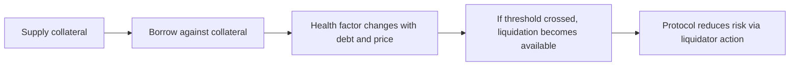

# 借贷状态、风险参数与清算主线

## 先理解什么

读 Aave 这类协议，最容易迷路的原因，不是代码太长，而是系统同时处理了很多维度：

- 资金流入流出
- 抵押与借款状态
- 风险参数
- 价格输入
- 清算与坏账控制

如果你还是沿着“一个函数一个函数读”的习惯推进，很容易很快失去主线。  
更好的办法，是先问：这个系统到底在维护哪些最关键的风险事实？

### 先把几个词钉牢

**Debt Token** 是借贷协议用来表示债务头寸的记账代币。直觉上它像协议内部给借款人开的欠条。工程上这意味着很多借贷协议不是直接改一个数字，而是通过 debt token 体系来表达债务。

**Liquidity Index** 是借贷协议用来累计利息和份额变化的指数型记账参数。直觉上它像协议用来统一放大或折算仓位价值的倍率尺。工程上这意味着读 Aave 这类协议时，看懂 index 往往比看懂单条转账更关键。

**清算路径（Liquidation Path）** 是风险仓位从触发条件到被外部处置的执行路径。直觉上它像系统发生危险时自动启动的处置流程图。工程上这意味着你读借贷源码时，要顺着 liquidation path 看系统怎样自救。

## 为什么重要

借贷协议比 AMM 更适合训练“带着风险视角读源码”的能力。  
因为你不只要理解它怎么让用户存钱借钱，还要理解它怎么避免系统被坏账拖垮。

这意味着你的阅读重点应该从一开始就落在：

- 账户状态
- 抵押参数
- 健康度判断
- 清算路径

而不是只盯着业务入口名字。

## 核心机制

### 1. 先抓系统在维护什么状态

阅读借贷协议的第一步，不是记住所有模块，而是识别最核心的状态层：

- 每个资产池的储备状态
- 用户的抵押与债务状态
- 每种资产的风险参数
- 价格读取结果

只要这四类状态清楚了，很多函数都会自动归位。

### 2. 供给、借款、偿还、提取只是主线入口

这些入口函数当然重要，但它们真正的意义，在于会改变哪类状态：

- `supply` 改变储备与用户抵押关系
- `borrow` 增加债务并消耗安全边际
- `repay` 降低债务
- `withdraw` 减少抵押并影响健康度

也就是说，入口函数是主线上的门，真正值得读的是门后面怎么改状态。

### 3. 风险参数决定系统不是“随便借”

借贷协议真正复杂的地方，不在转账本身，而在风险控制。  
例如：

- collateral factor
- liquidation threshold
- reserve configuration
- borrowing caps

这些参数会决定系统容忍什么风险、允许什么资产扮演什么角色。

### 4. 清算路径是借贷协议阅读的关键闭环

只要你读懂清算路径，很多前面的设计都会突然变得合理。  
因为清算正是协议对“仓位不再安全”时的自救方式。

你应该重点看：

- 何时判定仓位危险
- 价格如何参与判断
- 清算者如何介入
- 清算后系统风险如何下降

### 5. 阅读顺序应该从结构到风险闭环

一个实用顺序通常是：

1. 先看文档或产品层，知道系统给用户看什么
2. 再找核心状态结构
3. 再看供给、借款、偿还、提取入口
4. 最后重点看清算与风险参数

这样你读源码时，心里始终有“系统在维持什么安全事实”的主线。

## 工程判断

以后读任何借贷协议，都可以先问：

1. 核心状态有哪些？
2. 风险参数存在哪里？
3. 价格输入如何接入？
4. 健康度如何被计算或近似表达？
5. 清算如何收敛系统风险？

只要这五个问题能说清，复杂协议就不再只是“很多模块”。

## 本节小结

阅读 Aave 这类借贷协议时，真正的主线不是函数目录，而是状态与风险控制闭环。供给、借款、偿还和提取只是入口，健康度、价格输入、参数配置和清算路径才是系统真正的骨架。抓住这条主线，你读复杂 DeFi 协议的能力会明显提升。
