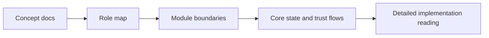

# 如何阅读 Restaking 这类复杂系统

## 先理解什么

当你读到更复杂的协议时，最容易出现两种极端：

- 还没开始就觉得太难，不敢碰
- 一上来就扎进源码细节，很快失去方向

EigenLayer 这类系统正好适合作为一个训练样本，因为它天然包含：

- 多角色
- 多模块
- 多层信任关系
- 较强概念前置

所以它更像一场“阅读复杂系统的方法训练”，而不只是一个具体协议。

## 为什么重要

如果你只会读单一主线、单一池子、单一入口的协议，那么一旦碰到多模块系统，就很容易掉进“看懂了很多局部，仍然不知道整体在干什么”的状态。

复杂协议阅读真正要练的能力是：

- 分层
- 抽象
- 识别角色与边界
- 识别哪些模块是核心，哪些是实现细节

这会直接决定你未来能不能读更大的 Web3 系统。

## 核心机制

### 1. 先抓“系统在重新组织什么资源和信任”

面对复杂协议，第一步不该是追函数，而该先问：

- 它想重新组织什么资产
- 它想重新分配什么信任关系
- 它新增了哪些参与者

例如 restaking 系统里，最关键的通常不是某个单独方法，而是：

- 谁把什么权利委托给谁
- 哪些安全假设被复用
- 风险如何被重新分配

### 2. 角色图比函数图更适合作为第一张地图

读复杂协议时，建议先画角色图：

- 用户
- operator
- validator
- middleware / service
- governance / admin

这样做的好处是，你会先知道“谁和谁有关系”，再去看“他们怎么通过代码协作”。

### 3. 模块阅读顺序应该从概念边界开始

不要一开始就试图顺着源码文件名线性看完。  
更稳的顺序通常是：

1. 先看官方概念文档
2. 再抓模块划分
3. 再找核心状态和关键角色交互
4. 最后再进具体实现细节

这样你读的不是孤立代码，而是带着概念骨架读实现。

### 4. 复杂系统更需要记录“不懂的地方属于哪一层”

很多时候你不是完全不懂，而是不清楚：

- 这是概念问题
- 这是经济模型问题
- 这是具体代码问题

把“不懂”分层之后，阅读压力会小很多，也更容易安排后续补课。

### 5. 目标不是一次吃透，而是逐轮逼近结构

复杂协议阅读应该允许自己分轮次推进：

- 第一轮抓角色和模块
- 第二轮抓资产与权限主线
- 第三轮抓关键实现

这种分层推进比“我要一口气看懂”更有效。

## 工程判断

以后面对复杂协议，先问：

1. 它在重组什么资源或信任？
2. 主要角色有哪些？
3. 哪些模块是骨架，哪些是细节？
4. 关键风险边界在哪里？
5. 我当前没懂的是概念层、经济层还是实现层？

这五问能帮你把复杂度拆开，而不是被复杂度压住。

## 本节小结

阅读 EigenLayer 这类复杂系统时，真正重要的不是一开始就读完所有源码，而是先建立角色图、模块图、信任边界图，再逐轮深入实现。复杂协议阅读不是一场记忆比赛，而是一场结构化理解训练。
