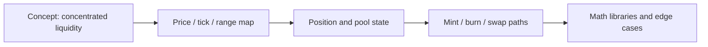

# 集中流动性协议应该怎样读

## 先理解什么

很多人读 Uniswap V3 的第一反应都是：

- 文件多
- 数学多
- 状态更新密
- 一眼看上去很难

这很正常。  
因为 V3 相比 V2，最大的变化不是多了一些优化细节，而是整个流动性表达方式变了。

如果 V2 的核心直觉是“一个统一池子里的全区间流动性”，  
那 V3 的核心直觉则是“流动性带着价格区间分布存在”。

你不先抓住这一点，后面的代码细节会非常容易失焦。

## 为什么重要

Uniswap V3 很适合做协议阅读训练样本，因为它要求你同时处理：

- 更复杂的状态表达
- 更强的数学抽象
- 更细的头寸粒度
- 更丰富的边界条件

能读懂它，不只是多懂一个 DEX，而是你的协议阅读层级会往上跳一截。

## 核心机制

### 1. 先别急着读实现，先回答“V3 重新表达了什么”

读 V3 的第一问不该是“某个函数在干嘛”，而应该是：

- 它把流动性重新表达成了什么
- 为什么需要价格区间
- LP 头寸为什么不再是简单份额

一旦这层概念没立住，你会一直在函数表面打转。

### 2. V3 阅读的第一张图应该是“价格区间与头寸关系图”

相比 V2，V3 的阅读入口更适合从这些对象开始：

- 当前价格位置
- tick / 区间边界
- 某个 LP 头寸覆盖的范围
- 范围内和范围外流动性的不同语义

这张图会比直接读 swap 实现更先帮你找到方向。

### 3. 第二张图是“状态更新在穿越区间时怎样变化”

V3 难的地方之一在于：  
交易不只是改一个统一池子状态，而可能随着价格移动穿越不同区间边界。

所以第二步要抓的是：

- 当前价格如何移动
- 穿越某个 tick 时会触发什么状态变化
- 头寸、费用和流动性如何重新归属

一旦你把“价格移动 = 穿越状态边界”这件事抓住，很多实现细节就会更有意义。

### 4. 第三张图再去看模块职责，而不是一次看全仓库

建议用下面的顺序：

1. 概念与对象图
2. 核心状态与边界
3. 关键路径：mint / burn / swap
4. 再去看数学与库实现

不要一开始就把所有库和运算细节全展开。  
那会很快耗尽注意力。

### 5. V3 的复杂度很大一部分来自“状态粒度变细”

V2 的很多直觉在 V3 里不再直接成立，因为：

- LP 不再共享完全相同的暴露区间
- 费用归集更细
- 流动性不再被简单理解为“池子总量”

所以你要不断提醒自己：  
现在读的不是“更快的 V2”，而是“流动性表达模型变化后的新系统”。

### 6. 阅读目标不是先推完数学，而是先抓结构，再逐步压数学

面对 V3，很多人会因为数学表达停住。  
更稳的顺序是：

- 先抓状态对象和关系
- 再抓状态变化主线
- 最后逐步压数学细节

## 工程判断

以后你读 Uniswap V3 或类似复杂协议时，先问：

1. 这个系统重新表达了什么核心对象？
2. 第一张最重要的结构图应该画什么？
3. 状态变化是随着哪条主线推进的？
4. 当前卡住我是因为概念没懂、状态没懂，还是数学没懂？
5. 我是不是太早陷入局部实现，而还没抓住整体骨架？

这五问能帮你在复杂协议面前保持方向感。

## 本节小结

阅读 Uniswap V3 的关键，不是硬啃所有代码，而是先抓“集中流动性”这个重新表达世界的方式，再沿着价格区间、头寸状态和关键路径逐层深入。复杂协议阅读最重要的不是速度，而是结构感。
