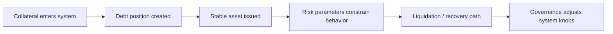

# 怎样阅读一个“货币系统型协议”

## 先理解什么

很多协议阅读，到前面几章为止，主要还围绕：

- 某种资产交换
- 某种借贷关系
- 某种系统模块拆分

而读 MakerDAO 时，你会更明显地感受到另一件事：

- 你不只是在读一个产品
- 你是在读一个带有货币系统味道的长期机制

这意味着你要关心的，不只是某个函数和某个合约，而是：

- 系统如何创造与约束债务
- 如何维持稳定
- 如何处理坏账与清算
- 如何用治理持续调节风险参数

### 先把几个词钉牢

**抵押债仓（Collateralized Debt）** 是以抵押物支撑并持续管理债务头寸的系统模型。直觉上它像你押了一份资产，然后围绕它开出一张可持续管理的欠条。工程上这意味着读 MakerDAO 时，核心不是稳定币表象，而是 collateralized debt 的整套调节机制。

**Stability Fee** 是为维持债务头寸而持续支付的稳定性成本。直觉上它像借用系统信用额度所要长期承担的持仓成本。工程上这意味着稳定协议不是只看发行量，还要看这条费率如何调节供需和风险。

**Governance** 是决定参数、规则和升级方向的协议治理机制。直觉上它像协议长期演化时的集体决策层。工程上这意味着很多协议风险不只来自合约本身，也来自 governance 能改什么、改得多快。

## 为什么重要

如果你还是用“找入口函数、看 swap 或 borrow 路径”那套单一路线去读，通常会很快迷失。  
因为 MakerDAO 的复杂性很大一部分来自：

- 对象之间的制度关系
- 参数和治理在系统中的位置
- 风险控制不是附属功能，而是主结构的一部分

所以它特别适合训练你从“功能阅读”走向“制度与机制阅读”。

## 核心机制

### 1. 第一张图不该是函数图，而该是资产与债务关系图

读 MakerDAO 的第一步，通常更适合抓：

- 用户拿什么抵押
- 系统怎样生成债务
- 稳定币怎样被铸出
- 风险怎样被清算和回收

这张资产与债务关系图，比直接去看某个实现文件更重要。

### 2. 第二张图是“风险控制在哪里被表达”

很多协议把风险控制当成边角机制。  
MakerDAO 这类系统不同，它会把风险控制深深嵌进系统骨架里：

- 抵押参数
- 清算条件
- 稳定费
- 债务上限
- 治理调参

所以第二张图要回答的是：

- 系统靠哪些旋钮维持秩序

### 3. 第三张图才去看模块边界

等你前两张图清楚之后，再去看：

- 哪些模块负责核心会计
- 哪些模块负责抵押与仓位
- 哪些模块负责清算
- 哪些模块负责治理和参数

这样你读模块时不会只看到文件，而会看到制度分工。

### 4. 阅读目标要从“功能流程”扩展到“系统稳态”

普通合约阅读经常关注：

- 某个操作怎样成功执行

而 MakerDAO 更值得问：

- 系统怎样在长期保持某种稳态
- 哪些机制在压力下会接手
- 哪些参数是在调节同一条风险链

这会让你的阅读从一次性交互，扩展到长期运行逻辑。

### 5. 术语很多时，最重要的是把术语重新挂回结构

阅读这类协议时，你迟早会遇到很多术语。  
真正高效的方法不是先背词表，而是问：

- 这个术语描述的是资产、债务、风险、治理，还是执行机制？

只要术语能挂回结构图，它就不再只是抽象名词。

### 6. 系统级协议阅读更像在读“规则系统”，而不是单个应用

你可以把 MakerDAO 这类协议想成：

- 一组合约
- 一套风险规则
- 一种货币管理机制
- 一层治理调节系统

## 工程判断

以后你读 MakerDAO 或类似系统时，先问：

1. 第一张资产与债务图画清楚了吗？
2. 风险控制到底在哪里被表达？
3. 当前看到的是执行细节，还是制度骨架？
4. 这个参数或术语属于哪类系统对象？
5. 我是否已经从“功能流程阅读”切到“长期稳态阅读”？

这五问能帮你在系统级协议前保持结构感。

## 本节小结

阅读 MakerDAO 这种货币系统型协议时，最重要的不是先啃所有实现，而是先抓资产、债务、风险和治理之间的骨架关系。只有这样，你才不会在大量模块和术语里迷路，而能真正看见系统怎样运转。
