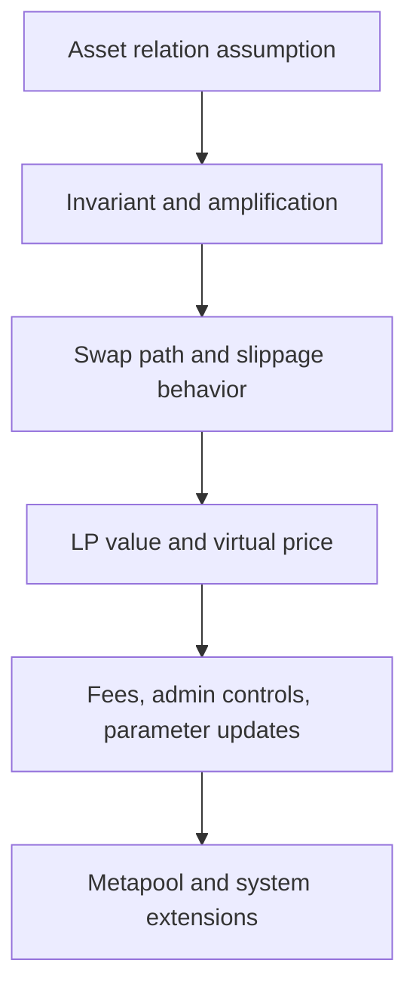

# 怎样阅读稳定交换系统

## 先理解什么

如果你已经读过 Uniswap V2，很容易形成一个默认模型：

- 池子里两种资产
- 价格沿着某个 invariant 曲线变化
- 交易影响储备比例和滑点

Curve 当然也属于 AMM 世界，但它解决的问题不一样。  
它不是单纯追求“任何两种资产都能交换”，而是针对：

- 价格本就应该彼此接近的资产

例如稳定币、锚定资产或包装资产。  
因此你在阅读时，必须先带着“资产相关性假设”进入。

### 先把几个词钉牢

**放大系数（Amplification Coefficient）** 是 Curve 类稳定曲线用来调整价格敏感度的关键参数。直觉上它像把池子在稳定区间内变得更“平”的调音旋钮。工程上这意味着 amplification 直接影响稳定资产交易效率和失衡时的风险表现。

**不变量曲线（Invariant Curve）** 是协议用来约束池子状态和报价关系的核心数学曲线。直觉上它像 AMM 世界里决定价格怎么动的地形。工程上这意味着读 Curve 时，你真正要先理解的是 invariant curve，而不是表面 swap 接口。

**Virtual Price** 是稳定池份额对底层资产价值的内部参考价格。直觉上它像池子自己对 LP 份额价值的内部估价。工程上这意味着 virtual price 往往是判断收益、风险和池子健康度的重要信号。

## 为什么重要

如果你用普通 AMM 心态去读 Curve，很容易误解：

- 为什么要引入 amplification 参数
- 为什么池子在某些区间滑点特别低
- 为什么价格偏离过大时表现又会变得像另一种系统
- 为什么 virtual price、admin fee、metapool 这些概念如此重要

也就是说，Curve 的难点不是代码更花，而是它把“资产应该彼此接近”这个前提写进了系统结构里。

## 核心机制

### 1. 先确认池子在假设什么资产关系

阅读 Curve 或任何 stable-swap 系统时，第一步不要急着看每个函数，而是先问：

- 这个池子服务的资产，理论上为什么应该接近 1:1？
- 如果它们偏离，这个偏离是暂时波动，还是系统性脱锚？

因为稳定交换系统的全部价值，都建立在：

- “大多数时候，资产应该比较接近”

这个假设上。

### 2. amplification 参数是在“改变曲线局部形状”

普通恒定乘积池在任何位置都遵循相同大类曲线逻辑。  
Curve 的关键创新之一，是通过 amplification（通常写作 `A`）让池子在接近平衡时表现得更“平”。

高层直觉是：

- 资产接近平衡时，给你更低滑点
- 偏离越来越大时，系统逐渐恢复更强保护

所以阅读时不要只把 `A` 当一个参数记住，而要问：

- 它在鼓励什么区间的交易体验？
- 它在什么情况下会暴露更强风险？

### 3. 阅读主线要从 invariant 和价格行为开始

Curve 代码很多，函数也不少。  
但主线通常可以先抓这几件事：

1. 池子状态变量有哪些  
2. invariant 如何被求解或近似求解  
3. 交易时怎样更新余额和价格关系  
4. fee 从哪里扣、进到哪里  
5. LP 价值如何体现  
6. 管理权限能改哪些关键参数

如果你一开始就扎进具体实现细节，很容易在数学和代码之间来回迷路。

### 4. virtual price 帮你观察 LP 份额价值演化

很多人读 stable-swap 时会忽略 LP 视角，只盯交易。  
其实协议阅读里一个很重要的问题是：

- 提供流动性的人最终持有什么价值轨迹？

这时 `virtual price` 一类概念就很关键，因为它帮助你观察：

- LP 份额相对底层资产组合的价值变化
- 费用累积、池子表现和份额价值之间的关系

所以读 Curve 时不要只读 swap path，也一定要看 LP path。

### 5. 管理面和参数面同样重要

稳定交换系统往往不是只有纯数学。  
你还要盯住：

- 参数谁能改
- fee 谁能调
- admin fee 如何收取
- 新池、metapool 或治理动作如何影响旧池行为

这类内容经常决定：

- 系统是否真像你以为的那样“自动”
- 风险是否其实掌握在治理与运维层

### 6. 阅读顺序最好从“结构图”而不是“逐行”开始

一个更稳的 Curve 阅读顺序通常是：

1. 白皮书或高层设计，先理解 stable-swap 想解决什么  
2. 找到核心 pool 合约与 math 相关代码  
3. 梳理状态变量与关键入口  
4. 追 swap、add liquidity、remove liquidity 三条主流程  
5. 再看 fee、admin、parameter update 与 metapool 扩展

你甚至可以先写一张伪目录：

```text
Pool state
Math / invariant
Swap path
Liquidity add/remove path
Fee path
Admin / governance path
```

这比一上来逐行通读更有效。



## 工程判断

以后你读 Curve 或任何 stable-swap 系统时，优先问：

1. 协议在假设什么资产关系？
2. amplification 在改变哪段曲线体验？
3. 交易者与 LP 分别从哪里获益、承担什么风险？
4. 参数和 fee 的控制权在谁手里？
5. 一旦稳定假设失效，系统会怎样表现？

只要这几件事理顺，你读 Curve 就不会只剩下数学焦虑。

## 本节小结

阅读 Curve 的关键，不是先把所有公式背下来，而是先理解它针对的是“本应接近的资产”，并围绕这一假设组织了 invariant、amplification、fee 与 LP 价值路径。掌握这条主线，源码阅读就会清晰很多。
